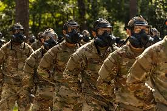

  

In **February 2023**, I graduated from **Basic Combat Training (BCT)** at Fort Leonard Wood, Missouri.  
BCT was a complete transformation, teaching me discipline, resilience, and the ability to work as part of a team under pressure. The experience was physically demanding and mentally challenging, but it gave me the foundation every soldier needs: attention to detail, accountability, and the mindset to push through when things are tough.  

From there, I moved on to **Advanced Individual Training (AIT)** at Goodfellow Air Force Base in San Angelo, Texas, graduating in **September 2023** as a **35N Signals Intelligence Analyst**.  
AIT focused heavily on technical skills—signal collection, analysis, and intelligence reporting. Training combined hands-on systems instruction with analytical thinking, preparing me to operate equipment in the field and contribute directly to intelligence operations.  

The hardest part of this journey was learning to balance the mental and physical stress of training while still performing at a high level. Whether it was ruck marches, field exercises, or long hours of technical coursework, I had to learn how to stay sharp and focused.  

The biggest takeaway for me was growth in **leadership and adaptability**. These experiences taught me not just how to follow orders, but how to step up, support my peers, and lead by example. The combination of discipline from BCT and technical expertise from AIT set the foundation for my career as a soldier and as a professional in intelligence and computer science.  
